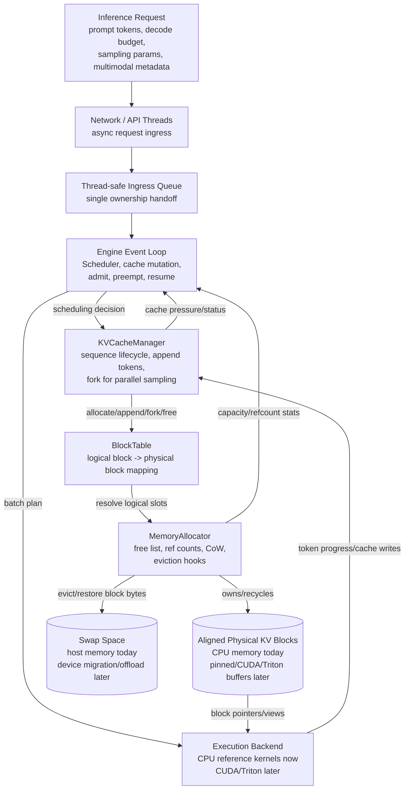

# QwenVL-Paged Memory Management Architecture

This document defines the first CPU-only architecture target for a production-grade
PagedAttention memory subsystem. The design intentionally separates request
scheduling, virtual block mapping, physical memory ownership, and KV cache policy
so the backend can later attach CUDA kernels, Triton CPU kernels, or custom
Qwen3-VL multimodal cache layouts without rewriting the allocator core.

## System Architecture Diagram



## Key Design Boundaries

- `Request` is an inference-level unit. It owns user-visible metadata, sampling
  parameters, multimodal feature descriptors, and decode limits, but not raw KV
  memory.
- `Scheduler` owns admission control and continuous batching decisions. It asks
  `KVCacheManager` whether a request can reserve or extend cache before placing
  it in the active batch.
- `KVCacheManager` owns sequence cache lifecycle. It creates block tables,
  appends logical tokens, forks tables for parallel sampling, and releases cache
  when requests finish or are evicted.
- `BlockTable` is the OS-like page table. It maps logical token blocks to
  physical blocks and supports shared mappings after prompt reuse or branch
  creation.
- `MemoryAllocator` owns physical blocks, reference counts, free lists, and
  copy-on-write materialization. It is the only component that mutates physical
  ownership.
- `PhysicalBlock` is backend-neutral. In the CPU prototype it references host
  memory allocated through a small aligned allocation abstraction. Later it can
  hold pinned host memory, CUDA allocation handles, stream ownership metadata,
  or Triton buffer descriptors behind the same logical interface.
- `SwapBackend` is the eviction store. A swapped-out block holds no frame at
  all: swap-out copies its bytes into an opaque slot and returns the frame to
  the free list, leaving the logical entry to remember only the slot. Swap-in
  therefore restores into a *different* frame and remaps the entry. The CPU
  prototype keeps slots in host memory; the same interface is meant to later
  carry device-to-host migration or compressed/offloaded storage.
- Eviction *policy* is separate from eviction *execution*. The allocator can
  name a candidate through a registered callback, but never evicts inside
  `allocate`, because only the owner of the logical mappings can remap them.

## Concurrency Contract

The phase-1 allocator core is intentionally single-threaded. Network/API threads
may receive requests asynchronously, but they must transfer ownership into the
engine through an ingress queue. After admission, `Scheduler`, `KVCacheManager`,
`BlockTable`, `MemoryAllocator`, and any installed `SwapBackend` are mutated only
by the engine event loop.

This keeps copy-on-write and reference counting deterministic while the virtual
memory invariants are still being developed. If the allocator is later shared
across threads, `PhysicalBlockInfo::ref_count`, free-list mutation, block-table
remapping, and `ensure_writable` must be protected by a single allocator mutex or
converted to a carefully audited atomic protocol. Until then, these classes
should be documented and tested as non-thread-safe engine-thread components.

## KV Cache Block Layout

`BlockShape` states how large a block is; `KVBlockLayout` states how elements
are ordered inside it:

```
[layer][K|V][token_in_block][kv_head][head_dim]
```

`head_dim` is innermost, so one token's K (or V) vector for one head is
contiguous. That is the unit the attention inner loop consumes, and the unit a
CUDA or Triton kernel would want to issue as a single vectorized load. The K and
V halves of a layer are separated by `stream_stride()` so a kernel can address
them as two independent tensors sharing one allocation.

`KVBlockLayout::element_offset` is bounds-checked and returns offsets in
*elements*; multiply by `BlockShape::bytes_per_element` for a byte offset. All
translation from a sequence-global token position to a physical slot goes
through `CacheView::slot`, which performs the logical-to-physical lookup and
faults on unmapped or swapped-out blocks.

## Backend Integration Points

`CacheView` is the whole read contract for an execution backend: the page table,
an allocator to resolve physical block ids into storage, and the element layout.
It exposes no writable storage on purpose. A future CUDA or Triton backend
substitutes these pieces:

- **Block storage.** `PhysicalBlock` owns aligned host bytes behind a single
  allocation/deleter boundary. `HostMemoryOptions::prefer_pinned_memory` is the
  hook where `cudaMallocHost`/`cudaFreeHost` or a Triton buffer provider
  replaces `std::aligned_alloc`, with no change above `MemoryAllocator`.
- **Block table transfer.** GPU kernels want the mapping as a flat integer
  array rather than as a walked structure. `BlockTable::entries()` is kept
  sorted by logical index, so a batch step can flatten it into the
  `[num_seqs, max_blocks_per_seq]` tensor that a paged kernel indexes.
- **Layout strides.** `KVBlockLayout`'s four strides are exactly the stride
  arguments a Triton `tl.make_block_ptr` or a CUDA indexing helper needs. The
  reference kernel and the device kernel must agree on them or the golden tests
  in `tests/PagedAttention.test.cpp` no longer describe device behavior.
- **Copy-on-write.** `MemoryAllocator::copy_block` is a `std::memcpy` today and
  becomes a `cudaMemcpyAsync` on the engine stream. It must remain ordered
  before any kernel that writes the copy.
- **Eviction.** `SwapBackend` is where device-to-host migration, compression, or
  offload attaches. `swap_out` already reclaims the frame and returns an opaque
  slot, which is the same shape as a device eviction.

### Synchronization Rules

The phase-1 core is single-threaded by contract, and an asynchronous backend
does not change that: it adds a *completion* dependency the engine must respect
before mutating cache state.

1. **Views are borrowed, not owned.** Any cache mutation (copy-on-write, swap
   in/out, release, or reserving new blocks) can remap entries. Backends must
   re-acquire a `CacheView` after every mutation instead of caching it across
   steps.
2. **Copy-on-write happens before the write is enqueued.** Call
   `ensure_token_writable` on the engine thread first, then enqueue the kernel
   against the returned block. A kernel must never be the thing that discovers a
   block is shared.
3. **A frame may not be recycled while a kernel still reads it.** `release` and
   `swap_out` return a frame to the free list immediately, so a later `allocate`
   can hand the same memory to another sequence. With an async backend the
   engine must wait on that step's completion event before releasing, swapping,
   or preempting any block the step touched.
4. **Reference counts stay on the engine thread.** `retain`, `release`, and the
   free list are deliberately non-atomic. They must never be called from a
   stream callback, completion handler, or worker thread; queue the intent back
   to the event loop instead.
5. **Block identity is stable, block placement is not.** A `PhysicalBlockId`
   keeps its storage for as long as it is allocated, but the *mapping* from a
   logical block to a frame changes under copy-on-write and swap-in.
   `PhysicalBlockInfo::generation` advances on recycle so a stale observation
   can be detected rather than silently trusted.
6. **Swapped-out blocks have no frame at all.** `BlockTable::lookup` and
   `CacheView::block_bytes` return nothing for them, and
   `paged_attention_decode` refuses the whole call rather than producing a
   partial result. Device backends must fault the same way.

## Phased Implementation Plan

### Week 1: Repository Foundation And Core Types

Milestones:
- Add a C++17 build skeleton, namespace policy, compiler warnings, and unit test
  framework.
- Define strongly typed identifiers for requests, logical blocks, physical
  blocks, token positions, and cache kinds.
- Implement immutable configuration structs for block size, layer count, head
  shape, dtype size, and capacity.
- Define the engine-thread ownership model and non-thread-safe core contracts.
- Add positional encoding metadata that can represent text 1D positions and
  Qwen-VL visual 2D/3D M-RoPE spans instead of assuming a flat token array.

Verification:
- Unit tests for identifier equality, config validation, and byte-size
  calculations.
- Unit tests for positional span validation across text, image, and video token
  ranges.
- CI target that builds tests with warnings enabled.

### Week 2: Physical Block Pool

Milestones:
- Implement CPU physical block allocation using RAII-owned aligned host memory.
- Centralize host allocation behind a tiny policy/deleter so replacing it with
  `cudaMallocHost`, `cudaFreeHost`, or a Triton buffer provider later is local.
- Enforce a default 256-byte alignment and round allocation sizes to alignment
  boundaries.
- Add free-list allocation and deterministic block recycling.
- Track block state, generation, reference count, and high-water memory stats.

Verification:
- Tests for allocate/free reuse, exhaustion, double-free rejection, and stable
  capacity accounting.
- Tests that every physical block pointer satisfies the configured alignment.
- Stress test that allocates and releases the full pool repeatedly.

### Week 3: BlockTable Virtual Memory Layer

Milestones:
- Implement logical-to-physical mapping, logical block growth, and lookup APIs.
- Add sequence-local block tables with sparse logical block support.
- Add invariant checks for missing mappings, invalid indices, and ownership.

Verification:
- Tests for append mapping, remapping, lookup misses, and release traversal.
- Property-style test that random logical operations preserve table invariants.

### Week 4: Copy-On-Write And Parallel Sampling

Milestones:
- Implement block-table fork for parallel sampling branches.
- Increase physical block ref counts on shared mappings.
- Add `ensure_writable` to materialize a private copy before mutation.
- Keep `retain`, `release`, and `ensure_writable` engine-thread-only in this
  phase; document that refcounts are deliberately non-atomic under the event-loop
  contract.

Verification:
- Tests for shared prompt blocks across branches.
- Tests proving writes after fork do not mutate sibling branches.
- Refcount tests for fork, partial release, and branch completion.

### Week 5: KVCacheManager Sequence Lifecycle

Milestones:
- Implement request/sequence creation, prompt prefill block reservation, decode
  append, and final release.
- Add cache views suitable for a CPU reference attention kernel.
- Preserve extension fields for Qwen3-VL multimodal feature spans and M-RoPE
  position metadata, including visual token spans that may consume hundreds of
  logical positions from one image.

Verification:
- Tests for prompt ingestion, decode token append, branch creation, and cleanup.
- Golden test with small synthetic KV tensors and logical block boundaries.

### Week 6: Continuous Batching Scheduler

Milestones:
- Implement pending, active, preempted, and finished queues.
- Add admission control based on available cache blocks and token budget.
- Add simple preemption policy for long-running requests under cache pressure.

Verification:
- Tests for FIFO admission, decode-step batching, request completion, and
  preemption/resume behavior.
- Simulation test with mixed prompt lengths and decode budgets.

### Week 7: Swap/Eviction Interfaces

Milestones:
- Add per-mapping swap metadata (`BlockTableEntry::swap_slot`) so an evicted
  logical block keeps its mapping while its physical frame is reclaimed, and
  `BlockTable::lookup` faults instead of resolving a stale frame.
- Define a backend-neutral eviction store (`SwapBackend`) for future host-device
  migration and compressed/offloaded block storage, with a host-memory
  implementation (`HostSwapBackend`) for the CPU prototype.
- Add allocator swap primitives (`swap_out`, `swap_in`, `discard_swapped`) that
  refuse to evict a block shared by more than one mapping, plus a sequence-level
  all-or-nothing restore in `KVCacheManager`.
- Add an advisory allocator callback for eviction candidate selection, keeping
  the choice of victim separate from the remapping that executes the eviction.
- Make scheduler preemption reclaim cache and record `PreemptionInfo`, and make
  admission refuse a prompt the cache cannot back without leaving sequence state
  behind.

Verification:
- Tests for preemption metadata correctness and blocked admission recovery.
- Scheduler simulation under artificial memory pressure.

### Week 8: Backend Integration Readiness

Milestones:
- Define backend-neutral cache view structs for kernels.
- Add a correctness-only CPU reference PagedAttention path that manually walks
  `BlockTable` mappings with naive loops over scattered physical blocks.
- Document CUDA/Triton integration points and required synchronization rules.

Verification:
- End-to-end CPU test for prefill plus decode over multiple active requests.
- Golden test proving the naive CPU kernel reads logical tokens in the same order
  across block boundaries and physically scattered cache blocks.
- Benchmark harness for allocator latency, fork cost, CoW cost, and scheduler
  throughput.

## Immediate Success Criteria

- The allocator can model PagedAttention as virtual block tables over physical
  KV cache blocks.
- Parallel sampling branches share prompt cache until a branch writes.
- Continuous batching can admit, step, finish, and preempt requests based on
  allocator pressure.
- Qwen3-VL-specific metadata can be carried through the scheduler and cache
  manager without changing the allocator ownership model.
