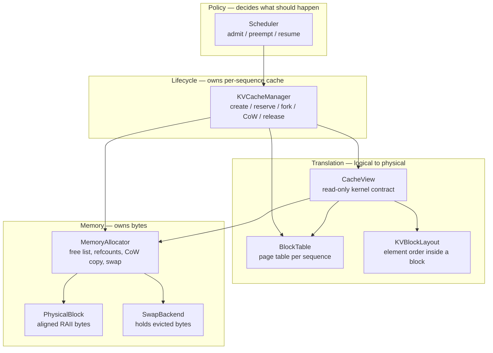
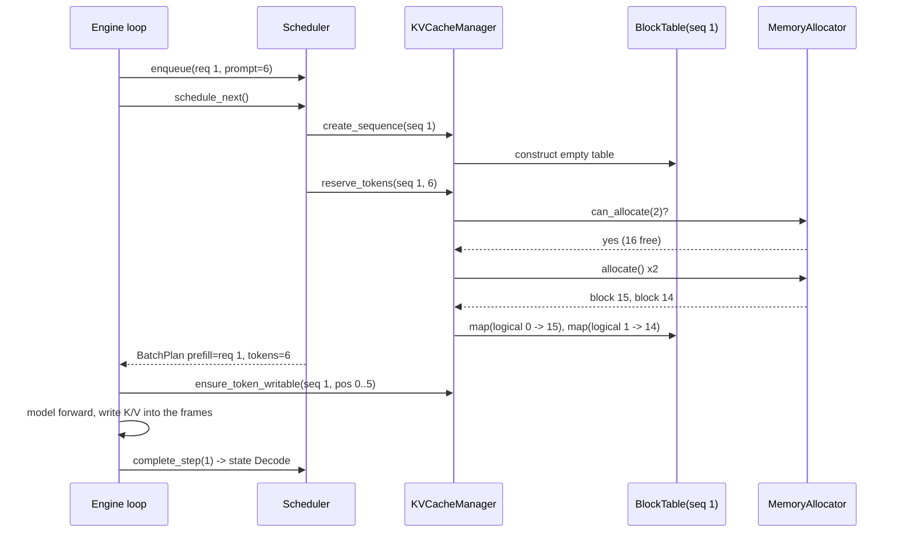

# A Walkthrough of the QwenVL-Paged Memory Subsystem

This document explains what this system does, why it is built this way, and how
data actually flows through it. It assumes you know what a transformer is but
not what an operating system's virtual memory looks like, and it is written so
that after reading it you can explain the design out loud to an interviewer or a
senior engineer.

[`docs/architecture.md`](architecture.md) is the *specification*: boundaries,
contracts, roadmap. This document is the *walkthrough*: motivation, worked
examples, and the reasoning behind each decision.

**Contents**

1. [The problem this system solves](#1-the-problem-this-system-solves)
2. [The core idea: KV cache as virtual memory](#2-the-core-idea-kv-cache-as-virtual-memory)
3. [The layer map](#3-the-layer-map)
4. [A bottom-up tour of the code](#4-a-bottom-up-tour-of-the-code)
5. [Worked dataflows](#5-worked-dataflows)
6. [Design choices worth defending](#6-design-choices-worth-defending)
7. [Invariants](#7-invariants)
8. [What is deliberately not built yet](#8-what-is-deliberately-not-built-yet)
9. [Interview cheat sheet](#9-interview-cheat-sheet)

---

## 1. The Problem This System Solves

### 1.1 What a KV cache is

When a language model generates text, it produces one token at a time. To
produce token number 501, the attention layers need the key and value vectors of
tokens 1 through 500. Those vectors do not change once computed, so recomputing
them every step would be pure waste. Instead the engine stores them. That store
is the **KV cache**.

The cache is large. Take a model with 32 layers, 8 key/value heads, and a head
dimension of 128, running in fp16 (2 bytes per element):

```
per token, per layer  = 8 heads x 128 dims x 2 bytes x 2 (one K, one V)
                      = 4,096 bytes
per token, all layers = 4,096 x 32 layers
                      = 131,072 bytes = 128 KiB
```

Every single token of context costs 128 KiB. This is the dominant memory
consumer in a serving engine — larger than the model weights once you have a few
dozen concurrent requests.

### 1.2 Why the obvious approach wastes almost everything

The obvious implementation is: give each request one contiguous buffer big
enough for the worst case. If the model supports 8,192 tokens of context, you
reserve 8,192 × 128 KiB = **1 GiB per request**, up front.

Now suppose the request actually produces 500 tokens:

```
reserved:  8,192 tokens = 1,024 MiB
used:        500 tokens =    62.5 MiB
wasted:                     961.5 MiB   (94%)
```

You cannot recover that memory, because you did not know in advance how long the
output would be, and the buffer must stay contiguous for the whole generation.
This waste is what caps how many requests you can batch, and batch size is what
determines throughput on a GPU.

There are three distinct kinds of waste hiding in that number:

| Waste | Cause | Example |
| --- | --- | --- |
| **Internal reservation** | You reserved for the worst case and used a fraction of it. | 8,192 reserved, 500 used. |
| **External fragmentation** | Free memory exists but not as one contiguous run, so a new request is rejected even though total free bytes would suffice. | 3 GiB free in 6 scattered chunks, a 1 GiB request fails. |
| **Duplication** | Two requests that share a prefix each keep their own byte-identical copy. | Parallel sampling: 4 branches of one prompt store the prompt 4 times. |

### 1.3 What paging buys you

Split the cache into small fixed-size **blocks** (say 16 tokens each) and let a
request's blocks live anywhere in the pool. Now the same 500-token request needs
`ceil(500 / 16) = 32` blocks:

```
reserved:  32 blocks = 512 token slots = 64 MiB
used:                  500 token slots = 62.5 MiB
wasted:                 12 token slots =  1.5 MiB   (2.3%)
```

Internal waste drops from 94% to under 3%, bounded by *at most one partially
filled block per sequence*. External fragmentation disappears entirely, because
every free block is interchangeable with every other. And because blocks are
addressed indirectly, two requests can point at the *same* block, which kills
the duplication problem too.

That is PagedAttention, and this repository is a from-scratch, CPU-first
implementation of the memory subsystem behind it.

---

## 2. The Core Idea: KV Cache as Virtual Memory

The insight that makes the whole design fall into place is that this is exactly
the problem an operating system solves with virtual memory, and it can be solved
with exactly the same machinery.

An OS lets a program believe it owns one flat address space, while the physical
RAM backing it is scattered pages that can be shared, copied on write, or
swapped to disk. A page table performs the translation.

Here, a *sequence* believes it owns one flat run of token positions
`0, 1, 2, ...`, while the physical blocks backing it are scattered frames in a
pool that can be shared, copied on write, or swapped out. A block table performs
the translation.

| Operating system | This system | Where in the code |
| --- | --- | --- |
| Virtual address | Token position | `TokenPosition` |
| Virtual page | Logical block (16 tokens) | `LogicalBlock` |
| Physical frame | Physical block | `PhysicalBlock` |
| Page table | Block table | `BlockTable` |
| Page fault | Lookup returns `nullopt` | `BlockTable::lookup` |
| Frame allocator + free list | Block pool | `MemoryAllocator` |
| `fork()` + copy-on-write | Parallel sampling branch | `fork_sequence`, `ensure_token_writable` |
| Swap to disk | Swap to backing store | `SwapBackend` |
| Process scheduler | Continuous batcher | `Scheduler` |
| MMU address translation | Slot resolution | `CacheView::slot` |

Whenever you are unsure what this codebase should do in some situation, ask what
an OS would do. That is not a coincidence — it is the design method.

---

## 3. The Layer Map

Eight types, in four layers. The rule that keeps the design clean: **each layer
knows only about the layer directly below it.**



| Component | One-line responsibility | Explicitly *not* its job |
| --- | --- | --- |
| `Scheduler` | Decide which requests run this step. | Owning memory, or touching block tables directly. |
| `KVCacheManager` | Own each sequence's cache lifecycle. | Deciding *which* request should lose its cache. |
| `BlockTable` | Map logical block index to physical block id. | Allocating or freeing anything. |
| `CacheView` | Give a kernel read-only access to a sequence's cache. | Writing, or keeping state across steps. |
| `KVBlockLayout` | Say where element `(layer, K/V, token, head)` sits in a block. | Knowing which block. |
| `MemoryAllocator` | Own every physical block, refcount, and free-list transition. | Knowing which sequence maps what. |
| `PhysicalBlock` | Own one aligned allocation with RAII. | Knowing about sequences or tokens. |
| `SwapBackend` | Hold the bytes of an evicted block. | Deciding what to evict. |

The single most important boundary: **`MemoryAllocator` is the only component
that may create, share, duplicate, or recycle physical blocks.** Everything else
manipulates *mappings*. If you ever need to find out why a block was freed,
there is exactly one file to read.

---

## 4. A Bottom-Up Tour of the Code

### 4.1 `BlockShape` and `PhysicalBlock` — one frame of memory

`BlockShape` (`include/qwenvl_paged/Block.h`) is five numbers that describe a
block, and `byte_size()` turns them into a byte count:

*`src/Block.cpp`*

```cpp
std::size_t BlockShape::byte_size() const noexcept {
    // A full block stores both the K and V streams for every layer, head, and
    // token slot, hence the factor of two.
    return static_cast<std::size_t>(tokens_per_block) * num_layers *
           num_kv_heads * head_dim * bytes_per_element * 2u;
}
```

Note what one block holds: **all layers**, both K and V, for `tokens_per_block`
consecutive token positions. A sequence does not get one block per layer; it
gets one block per 16 tokens, and that block is internally sliced by layer.

`PhysicalBlock` owns the bytes with a `unique_ptr` and a custom deleter,
allocated through `std::aligned_alloc` at 256-byte alignment by default. The
alignment exists so a future SIMD or GPU kernel can issue aligned vector loads,
and the size is rounded up to a multiple of the alignment because
`aligned_alloc` requires that.

The custom-deleter design is the extension point for GPU work: swapping
`std::aligned_alloc`/`std::free` for `cudaMallocHost`/`cudaFreeHost` is a change
to two functions in one file, and nothing above `MemoryAllocator` notices.

### 4.2 `KVBlockLayout` — the map of what is inside a frame

A block is just bytes. `KVBlockLayout` says how those bytes are ordered:

```
[layer][K|V][token_in_block][kv_head][head_dim]
   ^                                      ^
outermost                             innermost
```

The strides fall straight out of that ordering
(`src/CacheLayout.cpp`), all counted in **elements**, not bytes:

| Stride | Value | Meaning |
| --- | --- | --- |
| `head_stride()` | `head_dim` | step to the next kv head |
| `token_stride()` | `num_kv_heads × head_dim` | step to the next token |
| `stream_stride()` | `tokens_per_block × token_stride` | step from the K half to the V half |
| `layer_stride()` | `2 × stream_stride` | step to the next layer |

`element_offset(layer, stream, token_in_block, kv_head)` returns
`std::optional<std::size_t>` and returns `nullopt` for any out-of-range
coordinate, so a bad index can never be turned into an out-of-bounds pointer.

**Why `head_dim` innermost.** The innermost loop of attention is a dot product
between a query vector and a key vector, both `head_dim` long. Putting
`head_dim` innermost makes that entire vector contiguous, which is one
sequential read on CPU and one coalesced vectorized load on GPU. Any other
ordering makes the hot loop strided.

**Why K and V are separated by `stream_stride`.** They live in one allocation
(one block, one lifetime, one refcount) but at a fixed distance apart, so a
kernel can treat them as two independent tensors sharing a base pointer. You get
the simplicity of one allocation and the addressing of two tensors.

### 4.3 `MemoryAllocator` — the block pool

The constructor allocates **every block up front**:

*`src/MemoryAllocator.cpp`, constructor*

```cpp
    for (std::uint32_t i = 0; i < config_.max_blocks; ++i) {
        const PhysicalBlockId id = i;
        blocks_.push_back(std::make_unique<PhysicalBlock>(id, config_.block_shape, config_.memory_options));

        PhysicalBlockInfo info;
        info.id = id;
        info.state = BlockState::Free;
        info.ref_count = 0;
        info.generation = 0;
        infos_.push_back(info);

        free_list_.push_back(id);
    }
```

After construction the pool never calls `malloc` again. `allocate()` is a
free-list pop and `release()` is a push. That is why the benchmark measures
**6.4 ns for an allocate/release pair** — there is no memory management happening
at steady state, only integer bookkeeping.

The free list is a `std::vector` used as a LIFO stack (`back()` / `pop_back()` /
`push_back()`). LIFO is deliberate: the most recently freed block is the one
most likely to still be warm in cache.

Reference counting is the mechanism behind sharing:

- `allocate()` sets `ref_count = 1`, `state = Active`.
- `retain()` increments and sets `state = Shared`. **It refuses to act on a
  block with `ref_count == 0`** — a free block cannot be resurrected by a stale
  id.
- `release()` decrements; at zero it sets `Free`, bumps `generation`, and pushes
  onto the free list. **A release on a block already at zero is a no-op**, which
  is how double-free is rejected rather than corrupting the free list.

`generation` is a monotone counter bumped every time a frame is recycled. Its
purpose is stale-observation detection: a `PhysicalBlockId` is a stable *name*,
but the *contents* behind that name change when the frame is recycled. If some
future async backend recorded `(id, generation)` before a kernel launch, it can
tell afterwards whether the frame it read is still the frame it meant to read.

### 4.4 `BlockTable` — the page table

One `BlockTable` per sequence. Each entry is:

*`include/qwenvl_paged/BlockTable.h`*

```cpp
struct BlockTableEntry {
    LogicalBlock logical{};
    PhysicalBlockId physical_id{0};
    bool writable{true};
    /**
     * @brief Engaged while this block's contents live in the swap backend.
     *
     * The physical frame has been reclaimed, so `physical_id` is stale until the
     * block is swapped back in and the entry is remapped.
     */
    std::optional<SwapSlotId> swap_slot{};
};
```

Entries are stored in a `std::vector` kept **sorted by logical index**, with
`std::lower_bound` for lookup. This is a small but load-bearing choice:

- Sorted-and-contiguous means lookups are a binary search over a cache-friendly
  array, not pointer chasing through a hash map.
- More importantly, `entries()` is already in the exact order a GPU kernel wants
  it. A batched paged-attention kernel takes the mapping as a flat
  `[num_seqs, max_blocks_per_seq]` integer tensor. Because the vector is sorted,
  building that tensor is a straight copy with no sort step per batch.

Note the fault behavior in `lookup`:

*`src/BlockTable.cpp`*

```cpp
std::optional<PhysicalBlockId> BlockTable::lookup(LogicalBlockIndex index) const {
    auto it = lower_bound_index(entries_, index);
    if (it == entries_.end() || it->logical.index != index) {
        return std::nullopt;
    }
    if (it->swap_slot.has_value()) {
        return std::nullopt;
    }
    return it->physical_id;
}
```

A swapped-out entry returns `nullopt` *even though `physical_id` still holds a
number*. That number is stale — the frame went back to the free list and may now
belong to a different request. Returning it would be a silent cross-request data
leak. This is the single most safety-critical branch in the translation layer.

`fork(child_id)` copies the whole table, rewrites the owning sequence id, and
clears every `writable` flag. It does **not** touch refcounts — that is the
allocator's job, and the caller (`KVCacheManager::fork_sequence`) does it.

### 4.5 `KVCacheManager` — per-sequence lifecycle

This is where the interesting policy lives. Five operations matter.

**`reserve_tokens(seq, n)`** rounds `n` up to whole blocks, checks
`can_allocate` first, then allocates and appends that many blocks to the end of
the table.

One thing to understand clearly: the cache manager tracks **reserved capacity in
whole blocks, not committed token count**. It has no idea how many of those
slots hold real data. Each call appends `ceil(n / tokens_per_block)` *fresh*
blocks; it does not fill the partially used tail block from a previous call.
That means the caller must not blindly call `reserve_tokens(seq, 1)` on every
decode step or it would burn one block per token. The end-to-end test shows the
correct guard:

*`tests/EndToEnd.test.cpp`*

```cpp
    void ensure_capacity(SequenceId sequence_id, TokenPosition position) {
        const std::optional<CacheView> view = cache_.cache_view(sequence_id);
        ASSERT_TRUE(view.has_value());
        if (position / kTokensPerBlock >= view->block_table->size()) {
            ASSERT_TRUE(cache_.reserve_tokens(sequence_id, 1));
        }
    }
```

Keeping committed length in the engine rather than the cache manager is
consistent with the rest of the design — see the `context_len` discussion in
[§6.8](#68-context_len-is-a-caller-argument-not-cache-state).

**`fork_sequence(parent, child_meta)`** forks the table and retains every shared
block:

*`src/KVCacheManager.cpp`, `fork_sequence`*

```cpp
    BlockTable child_table = parent_it->second.text_table.fork(child_id);
    for (const BlockTableEntry& entry : child_table.entries()) {
        allocator_->retain(entry.physical_id);
    }
```

That is the entire cost of branching a sequence: one vector copy plus N integer
increments. The benchmark measures ~7 ns per shared block. No KV data is copied.

It refuses when the parent has any swapped-out block, because a swapped block
has no frame for the child to share. Swap the parent in first.

**`ensure_token_writable(seq, pos)`** is copy-on-write:

*`src/KVCacheManager.cpp`, `ensure_token_writable`*

```cpp
    if (info->ref_count <= 1) {
        entry->writable = true;
        return entry->physical_id;
    }

    const std::optional<PhysicalBlockId> copy = allocator_->allocate();
    if (!copy.has_value()) {
        return std::nullopt;
    }

    allocator_->copy_block(entry->physical_id, *copy);
    allocator_->release(entry->physical_id);
    entry->physical_id = *copy;
    entry->writable = true;
    return *copy;
```

Read the condition carefully: **the refcount is the authority, not the
`writable` flag.** The flag is a hint that gets repaired lazily. Concretely,
after a fork both branches have `writable = false`. When branch B writes, it
copies and becomes writable, dropping the original's refcount back to 1. When
branch A later writes, its flag still says `false`, but its refcount is now 1,
so it takes the fast path and simply flips the flag — no second copy. Deriving
the decision from the refcount rather than the flag is what makes that
"last branch standing keeps the original" behavior fall out for free.

**`swap_out_sequence` / `swap_in_sequence`** move a whole sequence to and from
the backing store. Swap-out skips any block with `ref_count != 1` (a sibling
branch still needs the frame) and returns how many blocks it actually moved.
Swap-in is **all-or-nothing**: it counts the swapped blocks and checks
`can_allocate` for all of them before restoring any, so a failed resume leaves
the sequence exactly as it was and can be retried later.

**`release_sequence`** walks the table and, per entry, either discards the swap
slot or releases the frame. Getting this asymmetry wrong leaks swap slots when a
preempted request is cancelled.

### 4.6 `CacheView` and `paged_attention_decode` — the read path

`CacheView` is the complete contract an execution backend needs: the block
table, the allocator (to turn an id into bytes), and the layout. Three
properties make it safe:

1. **It is read-only.** There is no `mutable_slot`. Writes must go through
   `ensure_token_writable`, which is the only path that can honor copy-on-write.
   A kernel must never be the thing that discovers a block is shared.
2. **It is borrowed, not owned.** Any mutation — CoW, swap, release, reserve —
   can remap entries. Backends re-acquire a view after every mutation instead of
   caching one across steps.
3. **It faults instead of guessing.** `block_bytes` returns `nullptr` for an
   unmapped or swapped-out block.

`slot<T>()` is the MMU. It takes a **sequence-global** token position and does
the translation:

*`include/qwenvl_paged/KVCacheManager.h`, `CacheView::slot`*

```cpp
    const std::uint32_t tokens_per_block = layout.shape.tokens_per_block;
    const std::optional<std::size_t> offset =
        layout.element_offset(layer, stream, token % tokens_per_block, kv_head);
    if (!offset.has_value()) {
        return nullptr;
    }

    const std::byte* bytes = block_bytes(static_cast<LogicalBlockIndex>(token / tokens_per_block));
    if (bytes == nullptr) {
        return nullptr;
    }

    return reinterpret_cast<const T*>(bytes) + *offset;
```

Divide for the block, modulo for the position within it, table lookup for the
frame, layout for the offset. It also checks `sizeof(T) == bytes_per_element`, so
reading an fp16 cache as `float` returns `nullptr` rather than garbage.

`paged_attention_decode` is a correctness reference, not a fast kernel. Its one
structurally interesting decision is that it **resolves every pointer before
computing anything**:

*`include/qwenvl_paged/PagedAttention.h`*

```cpp
    // Walk the page table for the whole context before computing anything.
    // Writing part of the output and only then discovering a swapped-out block
    // would leave the caller unable to tell a finished result from a truncated
    // one, so resolution failures must be detected while `out` is still clean.
    const std::size_t resolved = static_cast<std::size_t>(shape.num_kv_heads) * params.context_len;
    std::vector<const T*> keys(resolved, nullptr);
    std::vector<const T*> values(resolved, nullptr);
    for (std::uint32_t kv_head = 0; kv_head < shape.num_kv_heads; ++kv_head) {
        for (std::uint32_t token = 0; token < params.context_len; ++token) {
            const std::size_t index = static_cast<std::size_t>(kv_head) * params.context_len + token;
            keys[index] = view.slot<T>(KVStream::Key, params.layer, token, kv_head);
            values[index] = view.slot<T>(KVStream::Value, params.layer, token, kv_head);
            if (keys[index] == nullptr || values[index] == nullptr) {
                return false;
            }
        }
    }
```

The function is all-or-nothing: it either fills `out` completely or returns
`false` without touching it. Partial results are worse than no results, because
the caller cannot distinguish them from correct ones.

Grouped-query attention is supported by index arithmetic: query head `h` reads
kv head `h / (num_query_heads / num_kv_heads)`. Causal prefill needs no separate
entry point — it is this same call per prompt position `p` with
`context_len = p + 1`.

### 4.7 `SwapBackend` — the backing store

An abstract interface with four methods (`store`, `load`, `discard`,
`resident_slots`) and one host-memory implementation. The interface is
deliberately narrow and opaque: the allocator hands over a block and gets back a
`SwapSlotId`, and it never learns whether that slot is host RAM, a compressed
buffer, or an NVMe file.

The critical semantic is in `MemoryAllocator::swap_out`:

*`src/MemoryAllocator.cpp`, `swap_out`*

```cpp
    info.ref_count = 0;
    info.state = BlockState::Free;
    ++info.generation;
    free_list_.push_back(id);
    return slot;
```

**Swapping out returns the frame to the pool immediately.** This is what makes
swap useful — the whole point is to reclaim memory. The consequence is that
swapping back in gets a *different* frame, so the block table entry must be
remapped. That is why `BlockTableEntry` carries both `physical_id` and
`swap_slot`, and why `lookup` must fault on the latter.

`swap_out` also refuses when `ref_count != 1`: zero means there is nothing to
evict, and more than one means a sibling branch is still mapping the frame and
would be stranded.

### 4.8 `Scheduler` — continuous batching

Three `std::deque<Request>` queues: `pending_`, `active_`, `preempted_`.
Continuous batching means the engine does not wait for a whole batch to finish
before starting new work; every step it re-forms the batch from whatever is
runnable.

`schedule_next()` does two things. First, it admits from the front of `pending_`
while there is room:

*`src/Scheduler.cpp`, `schedule_next` admission loop*

```cpp
    while (!pending_.empty() && active_.size() < config_.max_active_requests) {
        Request& candidate = pending_.front();
        if (plan.scheduled_tokens + candidate.prompt_tokens > config_.max_batch_tokens) {
            break;
        }

        reclaim_for_admission(candidate.prompt_tokens, plan.prefill_requests.size());

        if (!cache_manager_->create_sequence(metadata_from(candidate))) {
            break;
        }
        if (!cache_manager_->reserve_tokens(candidate.root_sequence_id, candidate.prompt_tokens)) {
            // Leave nothing behind, so a later step can admit this request once
            // blocks are reclaimed.
            cache_manager_->release_sequence(candidate.root_sequence_id);
            break;
        }

        candidate.state = RequestState::Prefill;
        plan.prefill_requests.push_back(candidate.request_id);
        plan.scheduled_tokens += candidate.prompt_tokens;

        active_.push_back(std::move(candidate));
        pending_.pop_front();
    }
```

Note the `release_sequence` rollback when `reserve_tokens` fails. A
half-admitted request — a sequence that exists
but has no cache — would be an invisible leak and would block its own future
readmission. The failure path leaves the world exactly as it found it.

Also note that every failure `break`s rather than `continue`s. This is strict
FIFO with head-of-line blocking: a request that does not fit stops the whole
admission loop rather than letting smaller requests jump the queue. That is
still the default. Week 14 added decode-aware lifetime admission, chunked
prefill, and an opt-in size-aware skip; the snippet above is the week-6
baseline. See [§6.10](#610-strict-fifo-is-the-default-size-aware-is-opt-in).

Second, it appends every active request already in `Decode` state, one token
each. Requests admitted this step are in `Prefill` state, so they cannot appear
in both lists.

`reclaim_for_admission` is the automatic preemption policy, off by default
(`preemption_watermark_blocks == 0`):

*`src/Scheduler.cpp`, `reclaim_for_admission`*

```cpp
    while (active_.size() > admitted_this_step && allocator_->stats().free_blocks < required) {
        const std::uint32_t before = allocator_->stats().free_blocks;

        // Newest first among requests that predate this call: the oldest active
        // request is closest to finishing, so it is the most expensive one to
        // roll back, and anything admitted moments ago is already in the plan.
        const RequestId victim = active_[active_.size() - admitted_this_step - 1].request_id;
        if (!preempt(victim, "cache pressure watermark")) {
            break;
        }

        if (allocator_->stats().free_blocks <= before) {
            // Preemption reclaimed nothing, which happens when no swap backend
            // is installed. Parking more requests cannot help.
            break;
        }
    }
```

Four guard conditions are worth naming, because each one prevents a specific
pathology:

| Guard | Prevents |
| --- | --- |
| `needed > total_blocks` → give up immediately | Thrashing the entire batch for a prompt that can never fit anyway. |
| `required = min(needed + watermark, total_blocks)` | A large prompt starving forever behind a reserve it can never clear. |
| Skip the last `admitted_this_step` requests | Preempting a request the same call just put into the batch plan. |
| Break if `free_blocks` did not increase | Infinite preemption when no swap backend is installed and parking reclaims nothing. |

---

## 5. Worked Dataflows

All examples use the end-to-end test's configuration, which is small enough to
follow by hand:

```
tokens_per_block = 4      num_layers = 2      num_kv_heads = 2
head_dim         = 4      dtype      = fp32 (4 bytes)
pool             = 16 blocks
```

Derived: `token_stride = 2×4 = 8`, `stream_stride = 4×8 = 32`,
`layer_stride = 2×32 = 64`, `element_count = 2×64 = 128` elements =
**512 bytes per block**.

### Dataflow A: admitting a request and prefilling it

A request arrives with a 6-token prompt.



Step by step:

1. `reserve_tokens(1, 6)` computes `ceil(6/4) = 2` blocks.
2. `can_allocate(2)` passes.
3. Two `allocate()` calls pop the free list. The list is LIFO and was
   `[0,1,...,15]`, so it hands back **15 then 14** — physical ids are not
   sequential and never need to be.
4. The table is now:

   | logical | physical | writable | swap_slot | covers tokens |
   | --- | --- | --- | --- | --- |
   | 0 | 15 | true | — | 0–3 |
   | 1 | 14 | true | — | 4–7 |

5. Capacity is 8 token slots for a 6-token prompt. The 2 unused slots are the
   bounded internal waste — at most one partial block per sequence.
6. The engine writes KV. It calls `ensure_token_writable` first; refcount is 1,
   so it takes the fast path and returns the existing frame with no copy.
7. Attention for prompt position `p` runs with `context_len = p + 1`, which is
   what makes prefill causal.

### Dataflow B: a decode step crossing a block boundary

The prompt occupied positions 0–5. Decode writes 6, then 7, then 8.

- **Position 6** → `6 / 4 = 1`, logical block 1 exists. No allocation.
- **Position 7** → `7 / 4 = 1`, still block 1. No allocation. Block 1 is now
  full.
- **Position 8** → `8 / 4 = 2`, and the table has only 2 entries. The engine's
  `ensure_capacity` guard fires and calls `reserve_tokens(1, 1)`, which appends
  one block at logical index 2.

This is the moment paging pays off. Whichever frame is free at that instant gets
mapped — possibly `3`, nowhere near `14` and `15`. The sequence's cache is now
physically scattered, and nothing in the read path cares, because every access
goes through the table. The end-to-end test asserts that scattering actually
happens, so the kernel is genuinely exercised on the case it exists to handle:

*`tests/EndToEnd.test.cpp`*

```cpp
        if (highest - lowest + 1 != entries.size()) {
            any_scattered = true;
        }
    }
    EXPECT_TRUE(any_scattered);
```

### Dataflow C: address translation, exact arithmetic

Read the **Value** vector of token 6, layer 1, kv head 1.

```
Step 1 — split the global position
    logical block  = 6 / 4 = 1
    token_in_block = 6 % 4 = 2

Step 2 — translate through the page table
    BlockTable::lookup(1) -> physical id 14
    (nullopt here would mean unmapped or swapped out -> fault)

Step 3 — get the frame's base pointer
    allocator->block(14)->data()

Step 4 — compute the offset inside the block, in elements
    layer 1        ->  1 x layer_stride(64)  = 64
    Value stream   ->  1 x stream_stride(32) = 32
    token_in_block ->  2 x token_stride(8)   = 16
    kv head 1      ->  1 x head_stride(4)    =  4
                                       total = 116 elements

Step 5 — form the pointer
    base + 116 elements = base + 464 bytes
    4 contiguous floats (head_dim), ready for the dot product
```

Two divisions and four multiply-adds. That is the entire cost of virtual memory
here, and on GPU the block-table half of it is hoisted out of the inner loop.

### Dataflow D: parallel sampling with copy-on-write

The request wants 2 samples from the same prompt. Sequence 1 holds logical
blocks 0→15 and 1→14, both at `ref_count = 1`.

**Fork.**

```
fork_sequence(1, seq 2)
  BlockTable::fork      -> copy entries, writable = false on all
  retain(15), retain(14) -> both now ref_count = 2, state = Shared
```

State:

| | logical 0 | logical 1 |
| --- | --- | --- |
| seq 1 | phys 15, writable=false | phys 14, writable=false |
| seq 2 | phys 15, writable=false | phys 14, writable=false |
| refcount | 2 | 2 |

Zero KV bytes were copied. The 6-token prompt exists once in memory and is read
by both branches.

**Branch 2 writes token 7** (logical block 1):

```
ensure_token_writable(seq 2, pos 7)
  entry = seq2.logical[1], physical 14, ref_count = 2  -> must copy
  allocate()          -> block 13
  copy_block(14 -> 13) -> memcpy 512 bytes
  release(14)          -> ref_count 2 -> 1, state Active
  seq2.logical[1] = { physical 13, writable = true }
```

| | logical 0 | logical 1 |
| --- | --- | --- |
| seq 1 | phys 15 (rc 2) | phys 14 (rc 1) |
| seq 2 | phys 15 (rc 2) | **phys 13 (rc 1)** |

Only block 1 diverged. Block 0 — the shared prompt prefix — is still one copy.

**Branch 1 then writes token 7:** its `writable` flag still says `false`, but
`ref_count` is now 1, so it takes the fast path, flips the flag, and writes in
place. No second copy. The last branch standing inherits the original frame.

**Cost.** Fork is ~7 ns per block. CoW is one `memcpy` of a whole block —
7.8 µs for a 512 KiB production block, roughly 68 GB/s. The optimization lever
is therefore *how often CoW fires*, not how fast the copy is, and that is
governed by block size and write locality.

### Dataflow E: preemption and resume under cache pressure

The pool is nearly full and a new prompt is waiting.

```mermaid
sequenceDiagram
    participant S as Scheduler
    participant K as KVCacheManager
    participant A as MemoryAllocator
    participant W as HostSwapBackend

    S->>S: reclaim_for_admission(prompt, admitted=0)
    S->>A: stats() -> free_blocks too low
    S->>S: victim = newest active request
    S->>K: swap_out_sequence(victim)
    loop each resident block
        K->>A: swap_out(physical_id)
        A->>W: store(frame bytes)
        W-->>A: slot 7
        A->>A: ref_count=0, ++generation, free_list.push(id)
        K->>K: entry.swap_slot = 7
    end
    K-->>S: 2 blocks reclaimed
    S->>S: record PreemptionInfo{reason, 2}
    Note over S,A: frames are now free; the waiting prompt is admitted

    S->>K: resume(victim) -> swap_in_sequence
    K->>A: can_allocate(2)? (all-or-nothing)
    loop each swapped block
        A->>A: allocate() -> a DIFFERENT frame
        A->>W: load(slot 7) into it
        A->>W: discard(slot 7)
        K->>K: entry.physical_id = new frame; swap_slot.reset()
    end
    K-->>S: true -> state Decode, back in active_
```

The property to internalize: **swap-out reclaims the frame, so swap-in lands
somewhere else.** The logical block index never changes, so from the sequence's
point of view nothing moved — which is exactly the illusion virtual memory
exists to provide.

While the request is swapped out, `paged_attention_decode` refuses the call
outright, and the test asserts it:

*`tests/EndToEnd.test.cpp`*

```cpp
        EXPECT_FALSE(paged_attention_decode<float>(*view, query.data(), params, out.data()));
```

Without that fault, the kernel would read frames that now belong to a different
request — silently correct-looking, completely wrong output.

---

## 6. Design Choices Worth Defending

These are the decisions to be ready to justify. Each one has a real alternative
that a reasonable engineer might have picked.

### 6.1 Fixed-size blocks instead of contiguous per-request buffers

**Alternative:** one contiguous buffer per request, sized to the model's max
context.

**Why blocks won:** internal waste drops from ~94% to under 3% and is bounded at
one partial block per sequence; external fragmentation vanishes because all
blocks are interchangeable; and indirection makes prefix sharing and swapping
possible at all.

**What it costs:** one indirection per access, and the kernel must be written to
walk a block table. That is the entire reason PagedAttention needs a custom
kernel rather than a stock attention implementation.

**The tuning tension:** larger blocks mean fewer table entries and less
translation overhead, but more internal waste and a more expensive CoW copy.
Smaller blocks mean tighter packing but longer tables and more per-block
overhead. 16 tokens is the usual sweet spot.

### 6.2 `head_dim` innermost in the block layout

**Alternative:** any of the other 4! orderings, e.g. token-innermost.

**Why:** the innermost operation in attention is a `head_dim`-length dot product.
This layout makes that vector contiguous — one sequential read on CPU, one
coalesced load on GPU. The four strides are also exactly the arguments a Triton
`tl.make_block_ptr` or a CUDA indexing helper wants, so the reference kernel and
a future device kernel can be made to agree by construction.

### 6.3 Reference counting with copy-on-write, instead of eager copying at fork

**Alternative:** copy the parent's blocks when a branch is created.

**Why:** parallel sampling with `n` branches over a long prompt would otherwise
cost `n ×` the prompt cache, and most of those copies are never written. Fork
becomes an O(blocks) integer operation (~7 ns/block) instead of an O(bytes)
memcpy, and shared prefixes stay shared for as long as they are genuinely
identical.

**What it costs:** you now have shared mutable state, which means you need a
correct refcount protocol and a discipline that no write bypasses
`ensure_token_writable`.

### 6.4 The refcount, not the `writable` flag, decides whether to copy

This is a subtle one and it is worth raising unprompted, because it shows you
understand the invariant rather than the code.

`ensure_token_writable` branches on `info->ref_count <= 1`, treating `writable`
as a hint that gets repaired lazily. If it branched on the flag instead, the
last remaining branch of a fork would copy a block that nobody else references —
a pure waste of a `memcpy` and a frame. Deriving the decision from the single
source of truth makes the "last branch keeps the original" optimization
automatic.

### 6.5 The allocator never evicts inside `allocate()`

**Alternative:** on exhaustion, have `allocate()` pick a victim, evict it, and
return the freed frame — what a typical caching allocator does.

**Why not:** the allocator owns frames; it does **not** know which sequence maps
which frame. Evicting a frame requires remapping the block table entry that
points at it, and only the owner of that mapping can do that safely. An
allocator that evicted on its own would either need a back-pointer from frames
to mappings (an ownership inversion) or would leave dangling entries.

**What the code does instead:** it separates *policy* from *execution*.
`select_eviction_candidate()` is an advisory hook that only *names* a block;
executing the eviction stays with `KVCacheManager` and `Scheduler`, which own
the mappings. `allocate()` simply returns `nullopt` and lets the caller decide.

This "the layer that owns the mapping executes the remap" rule is the cleanest
single idea in the design.

### 6.6 Swap-out reclaims the frame; swap-in lands on a different one

**Alternative:** pin the frame while its contents are elsewhere.

**Why:** pinning defeats the purpose. Swap exists to free memory, so the frame
must go back to the free list. The consequence — swap-in gets a different frame
and the entry must be remapped — is the reason `BlockTableEntry` carries
`swap_slot` separately from `physical_id`, and the reason `lookup` must fault on
a swapped entry instead of returning the now-stale `physical_id`.

**The near-miss bug this avoids:** returning that stale id would hand one
request a frame that now belongs to another. Everything would run and produce
plausible numbers. This is why the "faults on swapped-out" behavior is asserted
in three separate test files.

### 6.7 Swap-in is all-or-nothing

**Alternative:** restore as many blocks as fit and resume partially.

**Why:** a sequence with a hole in the middle of its context cannot run
attention at all, so a partial restore consumes scarce frames while producing
nothing runnable — and under pressure that is exactly when it would happen.
Checking `can_allocate(n)` up front means a failed resume leaves the request
untouched and retryable.

### 6.8 `context_len` is a caller argument, not cache state

`PagedAttentionParams::context_len` comes from the caller. The cache manager
knows reserved *capacity*; it does not know how many slots hold committed
tokens.

**Why:** capacity and length change at different times for different reasons —
capacity grows when you cross a block boundary, length grows every step. Putting
both in one component means two sources of truth that can disagree. It also
mirrors how a batched GPU kernel actually works: it receives a per-sequence
length array alongside the block tables.

### 6.9 The kernel resolves all pointers before writing any output

`paged_attention_decode` walks the whole page table and collects every K and V
pointer before computing anything, so a fault leaves `out` untouched.

**Why:** a partially written output buffer is indistinguishable from a correct
one at the call site. The function's contract is binary: fully correct, or
`false` and untouched. This matters most under preemption, where a block can
legitimately be missing.

### 6.10 Strict FIFO is the default; size-aware is opt-in

`schedule_next` still `break`s out of the admission loop on any failure when
`SchedulerConfig::size_aware_admission` is false (the default). With it on, a
head that does not fit is skipped, each skip increments `admission_skips` on
the passed-over requests, and a head that hits `admission_skip_limit` blocks
again.

**Why FIFO stays the default:** it guarantees no starvation without a skip
counter, and it is the baseline week 14 had to beat. On a pool sized for the
batch, size-aware never fires. Under cache pressure it saved 3.5% of steps on
the bimodal trace and did not move p99 TTFT. The more complex policy is
available and has a starvation-freedom test; it is not the default because the
measured win is small and the fairness argument is the one that needed
proving.

### 6.11 Preempt the *newest* active request

**Why:** the oldest active request is furthest through its decode budget and
closest to freeing its cache voluntarily. Rolling it back throws away the most
work. The newest one has the least sunk cost. This is also why anything admitted
during the current `schedule_next` call is excluded from victim selection —
otherwise a single call could put a request in the batch plan and then preempt
it.

### 6.12 Admission is transactional

If `reserve_tokens` fails, the scheduler calls `release_sequence` before
breaking. A sequence that exists with no cache would be an invisible leak, and
`create_sequence` would then reject the request's own retry on the next step
because the id is already taken.

### 6.13 Single-threaded by contract, with non-atomic refcounts

**Alternative:** make `ref_count` atomic and guard the free list with a mutex
from day one.

**Why not yet:** the virtual memory invariants are the hard part, and they are
much easier to get right and to test when every mutation happens in one
deterministic order. Atomics would also add cost to the hottest path in the
system for a benefit nothing currently needs.

**Why this is a defensible position rather than a shortcut:** the contract is
written down, the required future changes are enumerated (one allocator mutex or
an audited atomic protocol covering `ref_count`, free-list mutation, block-table
remapping, and `ensure_writable`), and the async-backend rules are already
specified — most importantly that a frame may not be recycled while a kernel
still reads it, so `release`, `swap_out`, and `preempt` must wait on the step's
completion event.

### 6.14 Multimodal metadata is carried, not interpreted

`MultimodalSpan` and `PositionalEncodingSpan` (with 3D `(temporal, height,
width)` origins for Qwen-VL's M-RoPE) ride along in `SequenceMetadata`. Nothing
in the allocator, block table, or scheduler reads them.

**Why:** one image can expand into hundreds of patch tokens whose positional
encodings are 2D or 3D rather than a flat index. That matters enormously to the
model and not at all to the memory subsystem — to the allocator, a visual token
is a token. Keeping the metadata as inert payload means the multimodal path can
be built later without touching the ownership model. This is the concrete
meaning of the project's "Qwen3-VL metadata without changing allocator
ownership" success criterion.

---

## 7. Invariants

If you are ever debugging this system, these are the statements that must hold.
Most of them have a dedicated test.

**Memory**

1. `sum(ref_count over all blocks) == total number of block-table entries that
   are not swapped out`.
2. A block is on the free list **iff** `ref_count == 0`.
3. Every allocated block has `ref_count >= 1`.
4. `release` on a block at zero is a no-op; `retain` on a block at zero is a
   no-op.
5. `generation` is monotonically non-decreasing per block id and advances on
   every recycle (release-to-zero and swap-out).

**Mapping**

6. `BlockTable::entries()` is always sorted by `logical.index` with no
   duplicates.
7. An entry has an engaged `swap_slot` **iff** its bytes live in the backend, and
   in that state `physical_id` is stale and must not be dereferenced.
8. `lookup` returns a physical id **only** for a mapped, resident entry.

**Copy-on-write**

9. A write to a block with `ref_count > 1` always goes through a fresh frame.
10. After CoW, the writer's entry points at a frame with `ref_count == 1`, and
    the original's refcount is exactly one lower.
11. No sibling branch's visible bytes ever change as a result of another
    branch's write.

**Scheduler**

12. A request is in exactly one of `pending_`, `active_`, `preempted_`.
13. A request in `active_` or `preempted_` has a sequence in the cache manager;
    a request in `pending_` does not.
14. A request appears in at most one of `prefill_requests` / `decode_requests`
    in a given plan.

**Teardown**

15. After every request is cancelled, `free_blocks == total_blocks`,
    `active_blocks == 0`, `shared_blocks == 0`, and `swapped_blocks == 0`. The
    end-to-end test asserts exactly this, and it is the cheapest possible leak
    detector.

---

## 8. What Is Deliberately Not Built Yet

Being able to state the gaps precisely is worth as much in a review as the
design itself.

**Intentional scope boundaries**

- **The GPU backend exists.** Weeks 15–23 shipped a Triton decode kernel, a
  device-resident pool, and copy-on-write through `set_copy_hook`. What is
  still not built is a Triton *prefill* kernel, a fused batch in the Hugging
  Face generate path, quantized KV, device-aware swap, and CUDA graphs. Those
  are a new GPU session, not leftovers; see [`performance.md`](performance.md)
  "GPU Session Closed".
- **The CPU kernel is a correctness reference only.** No blocking, no
  vectorization, no online softmax, and it heap-allocates two pointer vectors per
  call. Its runtime is not a meaningful baseline, which the README states
  explicitly. Weeks 10–12 are the work that changes this.
- **Prefix caching across requests exists.** `publish_prefix` / `attach_prefix`
  are a content-hash index on `KVCacheManager`. The sharing machinery
  (refcounts, CoW) did not need changes below that layer, which is the
  walkthrough claim week 14 tested. Collision and cancel-one-sharer are
  tests, not comments.
- **Single cache stream.** `CacheKind` distinguishes `TextKV`, `VisionKV`,
  `RopeState`, and `Auxiliary`, but `KVCacheManager` holds one `text_table` per
  sequence and `ensure_token_writable` ignores the argument.

**Rough edges an attentive reviewer will find**

- `reserve_tokens` rounds up per call and always appends, so it cannot fill a
  partially used tail block. Callers must guard on
  `position / tokens_per_block >= table.size()`, as the end-to-end test does.
- `complete_step` subtracts `produced_tokens` from `remaining_prefill_tokens`
  and moves Prefill → Decode when that hits zero. It still never enforces
  `max_decode_tokens` and never moves a request to `Finished` — completion is
  entirely caller-driven via `cancel`.
- Nothing auto-resumes a preempted request. `reclaim_for_admission` preempts
  automatically, but `resume` must be called explicitly, so a naive loop can park
  a request forever.
- `max_batch_tokens` now caps both prefill chunks and decode tokens. Prefill is
  still scheduled first, so a full prefill chunk can starve decode in the same
  step; that is why chunking did not move token-cost TTFT.
- `stats()` is O(total_blocks) and is called two to three times per iteration of
  the preemption loop. Fine at 128 blocks, wasteful at 10,000; incremental
  counters would fix it.
- `BlockState::Swapped` is never assigned. A swapped-out frame becomes `Free`
  (correctly — it really is free), and `stats().swapped_blocks` is read from
  `SwapBackend::resident_slots()` instead. The enum value is vestigial.
- `PhysicalBlock`'s constructor does not check `std::aligned_alloc` for
  `nullptr`.

---

## 9. Interview Cheat Sheet

### The 30-second version

> Serving a language model means keeping a KV cache per request, and the naive
> approach — one contiguous max-length buffer per request — wastes over 90% of
> it, which caps your batch size and therefore your throughput. This project
> solves it the way an OS solves memory: fixed-size blocks in a shared pool,
> per-sequence page tables mapping logical token blocks to physical blocks,
> reference counting so parallel sampling branches share the prompt until one
> writes, copy-on-write when a branch diverges, and swap plus preemption when the
> pool runs dry. Internal waste drops to at most one partial block per sequence,
> and external fragmentation goes away entirely.

### The 2-minute version

Add: the layer split (Scheduler → KVCacheManager → BlockTable → MemoryAllocator,
each knowing only the layer below), the rule that the allocator is the only
component that mutates physical ownership, and the reason it never evicts inside
`allocate` — only the owner of a mapping can remap it, so policy and execution
are separated. Then mention that the whole thing is backend-neutral by
construction: the CPU implementation exists so that a CUDA or Triton kernel has
a golden result to reproduce.

### Questions you should expect

**"Why 16 tokens per block?"**
It trades internal waste against table length and translation overhead. Larger
blocks mean shorter tables and cheaper lookups but more waste in the tail block
and a more expensive CoW copy — CoW is a full-block memcpy, so it scales
linearly with block size. Smaller blocks pack tighter but lengthen every table
and add per-block overhead. 16 is empirically near the optimum; the code makes
it a configuration parameter rather than a constant.

**"What happens if two sequences write to the same block?"**
They cannot, by construction. A write must go through `ensure_token_writable`,
which checks the refcount and materializes a private copy if the block is
shared. The `CacheView` handed to kernels exposes no writable storage, so there
is no path that bypasses the check.

**"How do you avoid a use-after-free when a block is swapped out?"**
`swap_out` returns the frame to the free list immediately, so the entry's
`physical_id` becomes stale. The entry records a `swap_slot` instead, and
`BlockTable::lookup` returns `nullopt` whenever `swap_slot` is engaged. The
attention kernel resolves all its pointers up front and refuses the whole call
if any resolution fails, so it cannot produce a partial result from a recycled
frame.

**"Why aren't the reference counts atomic?"**
Because the system is single-threaded by contract, and that contract is written
down rather than assumed. Refcounts, free-list updates, and block-table remaps
all happen on the engine event loop. Making them atomic would cost the hottest
path in the system for a benefit nothing currently needs, and the invariants are
far easier to test in a deterministic order. The doc enumerates exactly what
must change if that assumption is dropped.

**"What breaks first at scale?"**
Cache pressure, not any of this bookkeeping. Allocation is 6.4 ns and scheduling
is 162 ns per request — both noise next to a model forward pass. The one number
that matters is copy-on-write, at 7.8 µs per 512 KiB block, and the lever there
is reducing how *often* it fires, not making the copy faster.

**"How would you extend this to GPU?"**
Four touch points, all already isolated. Swap `std::aligned_alloc` for
`cudaMallocHost` behind `PhysicalBlock`'s deleter. Flatten
`BlockTable::entries()` into the `[num_seqs, max_blocks_per_seq]` integer tensor
the kernel indexes — cheap because entries are kept sorted. Pass
`KVBlockLayout`'s four strides to the device kernel and validate it against the
CPU golden tests. Turn `copy_block` into a `cudaMemcpyAsync` ordered before any
kernel that writes the copy. The one genuinely new constraint is completion
ordering: a frame may not be recycled while a kernel still reads it, so
`release`, `swap_out`, and `preempt` must wait on the step's completion event.

**"What would you do next?"**
The CPU decode kernel is 2.4–3.0× the scalar oracle and still 4–11× under
the 35 GB/s DRAM roof. The isolated paging tax at image length is 2.43×
(stride inside a 1.75 MiB block, not the page walk). Week 12's thread pool
stays closed until one thread is near that roof. A layer-major store layout
would remove the tax without touching the allocator.

